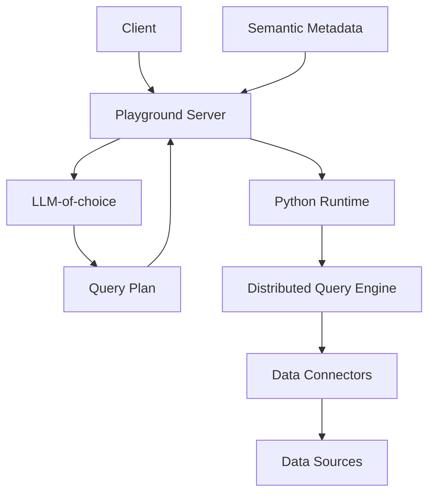

# Architecture

## Introduction

Below, you'll find a functional overview of PromptQL's architecture and the key components that power it. At the heart
of PromptQL is the **semantic metadata layer** — the intelligent foundation that makes natural language data queries
possible.

## High-level overview

## How it works

### Request initiation

When you ask PromptQL a question, the **Playground Server** receives your natural language query and combines it with
your **semantic metadata** — the intelligent layer that describes your connected data sources, schemas, relationships,
business logic, and access controls.

This metadata layer is generated automatically when you connect a data source and evolves as you and your team use
PromptQL.

### Query plan generation

The Playground Server sends both your question and the semantic metadata to your chosen LLM. **This semantic context is
what transforms a general-purpose LLM into a data expert for your specific organization.** The metadata tells the LLM
exactly what data exists, how it's structured, what different fields mean in your business context, and how tables
relate to each other.

With this rich context, the LLM generates a precise query plan that maps your natural language request to the right data
operations.

### Query execution

The Playground Server passes the query plan to PromptQL's **Python runtime**, which executes it through the
**distributed query engine**. The engine uses **data connectors** to fetch data from your **data sources**, respecting
all access controls and mappings defined in your metadata.

### Response delivery

The retrieved data flows back through the same path: from data sources through connectors, engine, and runtime, where
it's packaged and returned to you via the Playground Server.

This architecture ensures that your LLM has complete context about your data landscape while maintaining security and
performance through the distributed execution layer.

## Next steps

With a broad perspective of the different services powering a PromptQL application, we recommend learning more about the
[semantic metadata layer](/data-modeling/overview.mdx) next.
