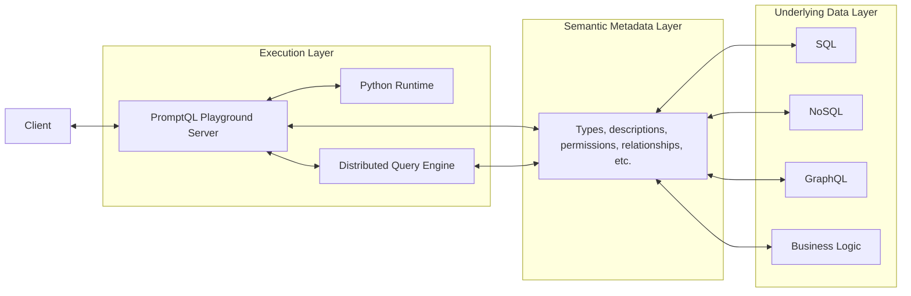

# Architecture

## Introduction

Below, you'll find an overview of PromptQL's architecture and the key components that power it.

## High-Level Overview

At a glance, PromptQL's stack can be thought of as three main layers:

- Execution
- Semantic Metadata
- Underlying Data Sources

### Execution Layer

The **execution layer** handles running queries, generating code, and coordinating actions across all parts of the
system. This is where users interact directly, either through the browser interface or exposed APIs.

#### PromptQL Playground

The Playground has two parts:

- A browser-based interface where users ask questions and guide automation workflows.
- A server that builds a **query plan** for each request and coordinates the runtime, query engine, and metadata to
  return a response.

#### Python Runtime

The runtime executes any code generated during query planning. This typically includes SQL for fetching data and Python
logic for transforming results or creating a **memory artifact**.

#### Distributed Query Engine

The engine links the playground server to the underlying data connectors. It uses the semantic metadata to generate,
optimize, and run queries across multiple sources in a consistent and secure way.

### Semantic Metadata Layer

The **semantic metadata layer** describes the structure, meaning, and access rules of your data. It defines types,
relationships, permissions, and descriptions that inform how queries are built.

#### Data Connectors

Each data connector reads a source’s schema and converts it into a shared metadata format. When combined, these schemas
form a unified graph that allows PromptQL to query across systems using the same logic.

### Underlying Data Layer

The **data layer** includes the actual systems that store or compute your data. These can be databases, APIs, or
internal services.

#### Datasources

PromptQL supports SQL and NoSQL databases, along with business logic implemented in TypeScript, Go, or Python. This
gives it broad access to both raw data and domain-specific functionality, making it easier to answer questions and
automate tasks.

## Next Steps

With a broad perspective of the different services powering a PromptQL application, we recommend learning more about the
[semantic metadata layer](/data-modeling/overview.mdx) next.
