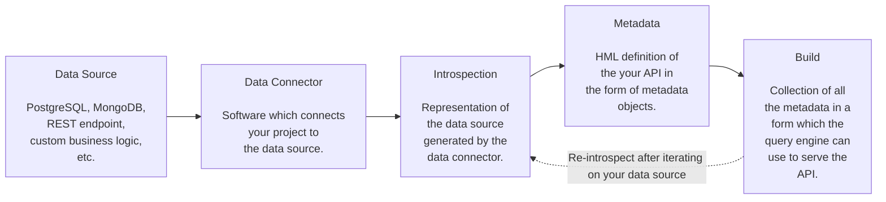

# Semantic Metadata

## Introduction

Your PromptQL application is powered by an agentic semantic metadata layer. This approach centralizes all your data
collections, operations, relationships, and permissions in one place. This makes it easy for you (and PromptQL) to
organize, modify, secure, reason about, and grow the schema which represents your API.

## Lifecycle

PromptQL uses this semantic metadata layer to define your API schema:

- Data connectors link to your data sources and introspect the source schema.
- The CLI then uses the introspection results to generate metadata objects.
- The metadata is then composed by the CLI into an immutable build, representing a snapshot in time, which is served by
  the distributed query engine to power PromptQL's interactions.

## Metadata Objects

There are [many types of metadata objects](/reference/metadata-reference/index.mdx) which define your API, but the most
important ones which form the backbone of your application are:

- [Models](/metadata/model.mdx) which read data
- [Commands](/metadata/command.mdx) which modify data
- [Relationships](/metadata/relationship.mdx) which connect data
- [Permissions](/metadata/permissions.mdx) which protect data

We will cover each of these in more detail in the following sections.
