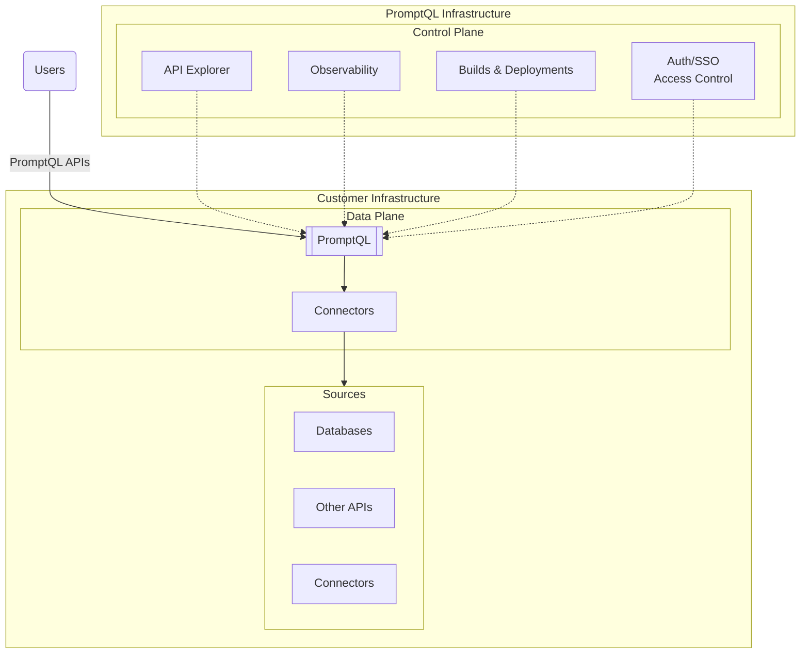

import Thumbnail from "@site/src/components/Thumbnail";

# Private DDN: Bring Your Own Cloud (BYOC)

## Introduction

Private DDN BYOC allows you to deploy the Data Plane component in your own cloud environment. This approach is useful if
you have specific requirements or constraints which prevent you from using the dedicated Data Plane on Hasura's cloud.

BYOC is currently supported on AWS, GCP and Azure.

If you would like access to Private DDN BYOC, please [contact sales](https://hasura.io/contact-us).

## Architecture

In the BYOC mode, the Data Plane is running on the customer's cloud account, while the Control Plane is running on
Hasura's cloud. The Data Plane is managed by Hasura's Control Plane, ensuing timely updates and maintenance. Uptime and
reliability of the Data Plane is a shared responsibility of the customer's infrastrucure team and Hasura's automated
systems.

:::info Data Plane stability

While essential for managing and updating the Data Plane, the Control Plane is not on the critical path for serving API
requests. Even if the Control Plane becomes unavailable, the Data Plane continues to operate without interruption.

:::

## Data Flow and security

All critical data operations occur exclusively within the customer infrastructure. When an API user sends a request,
it's received by Hasura in the Data Plane. Hasura then directly accesses the necessary data sources within the customer
infrastructure to fulfill the request. This direct access ensures that sensitive data never leaves the customer's
controlled environment, maintaining data residency and security.

While the Control Plane, situated in the Hasura infrastructure, does communicate with the Data Plane, this communication
is strictly limited to configuration and management purposes. Importantly, this communication does not involve customer
data or API responses, further enhancing data security.

The distinction between the Control and Data Planes creates well-defined security boundaries. By keeping the Data Plane
and all data sources within the customer's security perimeter, the architecture ensures that sensitive information
remains under the customer's control at all times.

## Interactions with the Control Plane

The Data Plane running on your infrastructure communicates with the Control Plane only in very specific scenarios:

1. Metadata Storage: The Data Plane accesses a metadata storage bucket to retrieve build artifacts; these artifacts are
   required to process API requests.
2. Build Metadata: The Data Plane accesses the Control Plane APIs to retrieve information about (applied) builds for the
   purposes of routing.
3. Connector Metadata: The Data Plane gets information about the connectors that needs to be deployed so that controller
   within the Data Plane can deploy them.
4. OTEL Gateway: (Optional) The Data Plane sends observability data to the Control Plane so you can visualize it on the
   console; it does not contain any API response data or variables.
5. BYOC Controller: The Control Plane interacts with the Kubernetes cluster to manage the Data Plane workloads.

<Thumbnail
  src="/img/deployment/private_ddn_byoc_detailed.png"
  alt="Detailed architecture diagram for Private DDN BYOC"
/>

## Upgrade Process

Regular software upgrades are rolled out to the Data Plane automatically. This incudes

- Hasura Engine version upgrades
- Other components on the Data Plane
- Kubernetes and other dependencies

Upgrades are typically seamless, utilizing rolling restarts. However, some upgrades (e.g., Kubernetes node upgrades) may
require customer-specified maintenance windows to minimize disruption.

## FAQ

##### What cloud providers are supported for BYOC deployment?

AWS, GCP and Azure are supported.

##### Which regions are supported for BYOC deployment?

Any region on AWS, GCP, Azure are supported, provided there is enough quota available for the workloads.

## Get started

To get started with Hasura DDN in your own cloud, [contact sales](https://hasura.io/contact-us).
