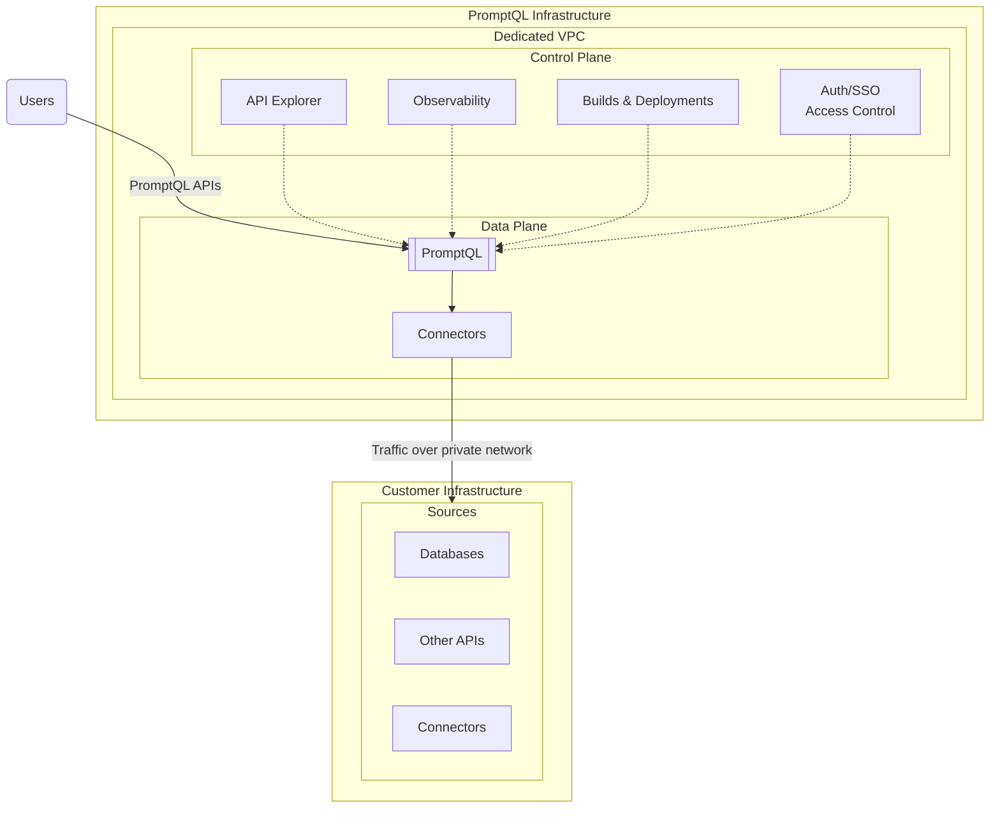

import Thumbnail from "@site/src/components/Thumbnail";

# Private DDN: Dedicated

## Introduction

Hasura manages the deployment, uptime, and availability of the Data Plane for you.

Hasura-hosted DDN is available on GCP, AWS, and Azure. It can be deployed to any region of your choice. You can select
multiple regions to set up a distributed-edge configuration to provide the lowest possible latency to your clients.

The Data Plane operates on a dedicated and isolated compute and network infrastructure, ensuring enhanced security and
compliance for your workloads. The infrastructure is set up using the highest isolation levels provided by the cloud
provider.

Private network connectivity is available through VPC Network Peering, Private Link / Private Service Connect, Transit
Gateway, or any other equivalent connectivity option offered by the cloud provider.

Please reach out to us if you need support for another cloud or configuration that is not mentioned here.

## Get started

To get started with Hasura DDN in Hasura Hosted VPC deployment mode, [contact sales](https://hasura.io/contact-us).
