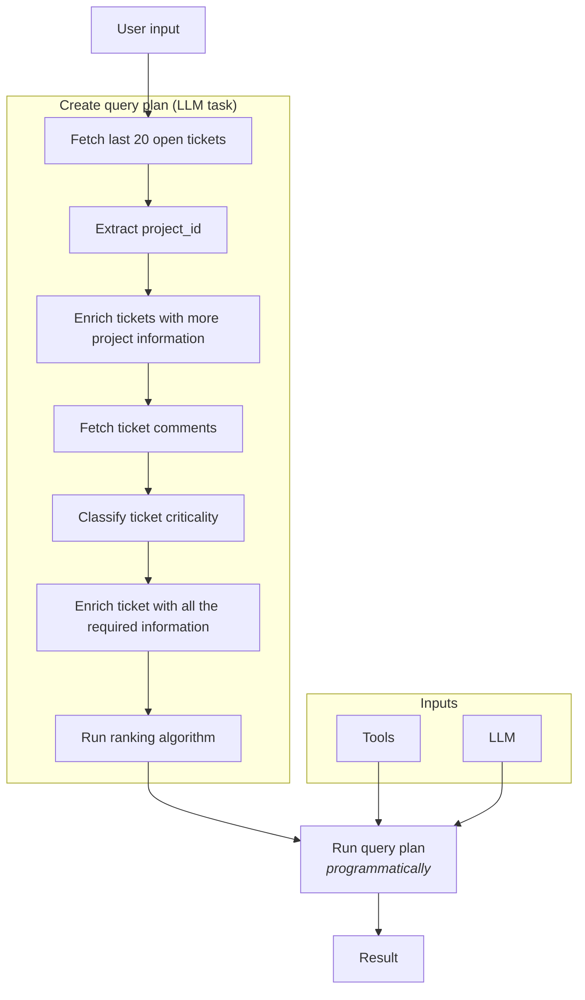

import { Grid } from "@site/src/components/Spec";
import Architecture from "@site/src/components/Benchmark/Architectures";
import Thumbnail from "@site/src/components/Thumbnail";
import ScoreCompareCharts from "@site/src/components/Charts/ScoreCompareCharts";
import Results from "@site/src/components/Benchmark";
import Gallery from "@site/src/components/Benchmark/Gallery";

# Case-study I - PromptQL vs MCP

:::info Work in progress

This case-study will gradually be formalized as a benchmark as we open-source more real-word datasets and user tasks.

**This was last updated on December 13th, 2024.**

:::

## Introduction

In contrast to traditional "in-context" approaches to connect LLMs to data, PromptQL takes a programmatic approach. A
PromptQL agent creates a query plan on the fly to compose retrieval, tool calling and generative tasks.

[Read the PromptQL Specification →](/reference/spec.mdx)

In this post, we compare PromptQL with [Claude.ai + MCP](https://www.anthropic.com/news/model-context-protocol),
connected to the same set of tools.

## 1. Data Domain & Architecture

The benchmark focuses on a customer success domain, integrating data from Zendesk and a user-product transactional
database. This setup simulates a real-world scenario where customer support interactions are linked with product usage
and purchase history, providing a comprehensive view of customer interactions and behavior.

<Architecture />

## 2. Evaluation set

The case-study focuses on interactions derived from 2 user-stories. Both these user stories involve multiple steps of
retrieval, transformation and intelligence. They are intended to represent typical high-value operations with business
data.

1. **A day to day task: Prioritize current open support tickets using a standard operating procedure.**

- Prioritization rules are gradually increased in complexity.
- The set of open tickets used is gradually increased in size.

2. **A planning task: Analyze underlying cause behind slow processing of support tickets.**

- The complexity of selecting which tickets to focus on is gradually increased.
- The set of tickets used is gradually increased in size.

## 3. Observations

We run each prompt five times, and record the accuracy of the result. Each result is a list of data points. In the heat
maps that you see below, columns represent a particular "run" and the rows represent the data points in the output.

<Results />

## 4. Examining failure of in-context approaches

### 4.1 Failure #1: Inability to follow a "query plan"

A query plan here refers to the underlying decision tree that describes the process of how to retrieve, process and
interact with data over multiple steps.

In-context approaches cannot separate the creation of a query plan from the execution of a query plan.

This results in a lack of repeatability. Increasing amount of data and information in the context window deteriorates
accuracy at each step of the query plan and hence further reduces repeatability.

<Gallery />

### 4.2 Failure #2: Natural query plans don't work

In-context approaches require that data is exchanged between tools in context, or processed in context. Natural sounding
query plans often require data to flow between steps with 100% reliability, but this runs against the LLMs natural
limitations, and in particular against output token limits.

<Thumbnail src="/img/get-started/challenge-2.png" alt="A limitation of query plans" className="thumbnail-small" />

<Thumbnail src="/img/get-started/failure2-computation-in-context.png" alt="A failure during computation" />

### 4.3 PromptQL approach: Decouple creation of the query plan from the execution of the query plan

PromptQL's key insight is that intelligence is required to create a query plan, but is not required to execute the query
plan. The execution of the query plan should be mechanical and 100% repeatable.

PromptQL's query plans are composed of steps that are computational and cognitive. These ensures intelligence can be
precisely used only in the isolated context of the step (eg: "extract project_id from the ticket description").

## 5. Evaluation Methodology

To measure usefulness of introducing an AI system into business processes, we calculate a usefulness score that is a
composite of two key measures:

1. Accuracy: The correctness of the result.

- **Computational accuracy**: The correctness of the result on a task that was possible to solve programmatically
- **Cognitive accuracy**: The correctness of the result on a task needing AI

2. Repeatability: How often is the result the same, across multiple runs of the same prompt.

- **Computational repeatability**: The repeatability of the computational part of the result.
- **Cognitive repeatability**: The repeatability of the AI part of the result.

### 5.1 Computational vs Cognitive

When working with business data and systems, computational accuracy and repeatability are usually more important than
"cognitive" accuracy and repeatability. That is to say, there is higher sensitivity and mistrust when an AI system fails
on an objective task, vs a subjective task.

For example: Imagine working with a colleague or an intern who is a "data access agent". This person can interact with
data for you and take actions based on your instructions. You would provide a lower performance rating to this agent if
they missed data or calculated something incorrectly. However, you would be more forgiving if they made a judgement call
on a subjective task.

### 5.2 A composite usefulness score

We factor these into a formula to calculate a usefulness score:

$$
\text{Usefulness} = (\text{CompAcc}^{w} \times \text{CogAcc}^{1-w}) \times (\text{CompRep}^{w} \times \text{CogRep}^{1-w})
$$

Where:

- $\text{CompAcc} (Computational Accuracy)$
  - A user-assigned score between 0 and 1 indicating how accurately the system handles computational (algorithmic)
    tasks.
- $\text{CogAcc} (Cognitive Accuracy)$
  - A user-assigned score between 0 and 1 indicating the system's accuracy on more interpretive, cognitive tasks.
- $\text{CompRep} (Computational Repeatability)$

$$
\text{CompRep} = \exp\left(-\alpha_C (1 - C)\right)
$$

This transforms the raw computational repeatability measure (C, ranging from 0 to 1) into a value between 0 and 1. A
higher αC means that any deviation from perfect computational repeatability (C=1) is penalized more severely. In plain
English: This score heavily rewards systems that deliver the same computational results every time.

- $\text{CogRep} (Cognitive Repeatability)$

$$
\text{CogRep} = \exp\left(-\alpha_K (1 - K)\right)
$$

Similar to CompRep, this takes a raw cognitive repeatability measure (K, 0 to 1) and maps it to a 0-to-1 scale. Here, αK
controls how harshly deviations from perfect repeatability are penalized for cognitive tasks. In other words, this score
measures how consistently the system provides similar cognitive outputs across multiple runs, typically allowing for a
bit more variation than computational tasks if αK is smaller than αC.

- $\text{w}$

A weighting factor between 0 and 1 that determines the relative importance of computational versus cognitive factors in
both accuracy and repeatability.

### 5.3 Evaluation parameters

- Humans label accuracy against a known correct answer with a numerical score between 0 and 1.
- Humans label repeatability of relevant outputs across multiple runs, with a numerical score between 0 and 1.
- αc: 8
- αk: 2
- w: 0.7

### 5.4 Prompting and Prompt input

We evaluate the usefulness of PromptQL and Claude.ai + MCP on the same user goal. This allows flexibility in optimizing
the prompt for each system in order to achieve the best possible score. In practice, this often meant that for Claude.ai
the prompt had to stress on ensuring that the input guidelines are followed strictly. For PromptQL, the prompt needed
basic awareness of the available AI primitives.

### 5.5 Evaluation results

<ScoreCompareCharts />

## 6. Coming Up

In the near future, we plan to expand our benchmark to include:

- Additional data domains such as e-commerce and financial services
- Comparison with more AI systems and traditional database querying methods
- Evaluation of data privacy and security aspects

## 7. Contribute & Test

Code and data for this comparison is available at:
[https://github.com/hasura/mcp-vs-promptql](https://github.com/hasura/mcp-vs-promptql).

We welcome contributions to our benchmark efforts. You can access our open-source benchmark toolkit, contribute test
cases, or run the benchmark on your own systems by visiting our
[Hasura Agentic Data Access Benchmark GitHub repository](https://github.com/hasura/business-data-benchmark). Your
participation helps us continually improve and validate the effectiveness of PromptQL and other agentic data access
methods.
